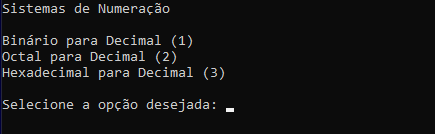

  <h1>Sistemas de Numeração</h1>
  

    
  

   
  
  <h3>Conversão de números: </h3>
  <ul>
    <li>Binário para decimal</li>
    <li>Octal para decimal</li>
    <li>Hexadecimal para decimal</li>
  </ul>
  
Feito em C#, teve o objetivo de treinar lógica de programação, utilizando conceitos vistos na faculdade.

